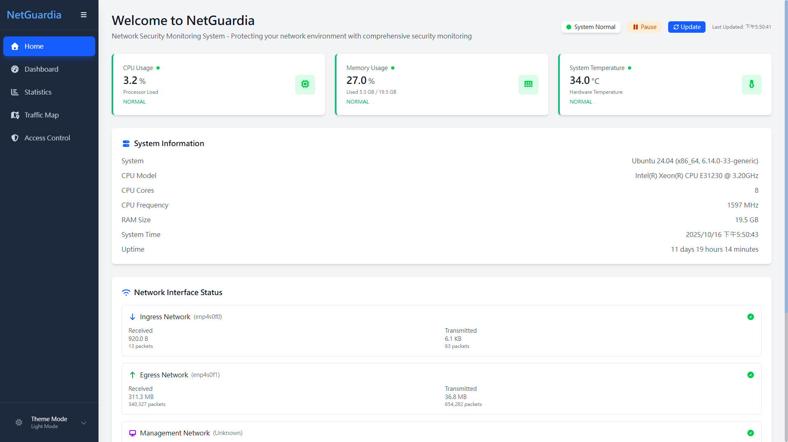
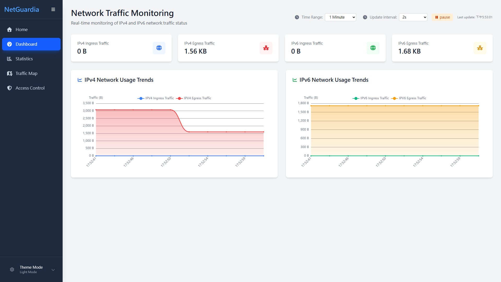
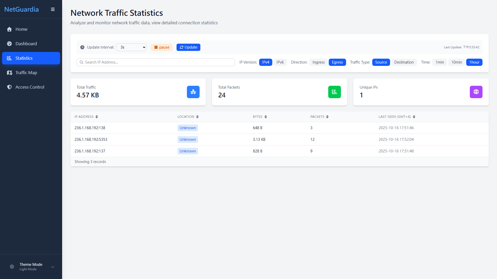
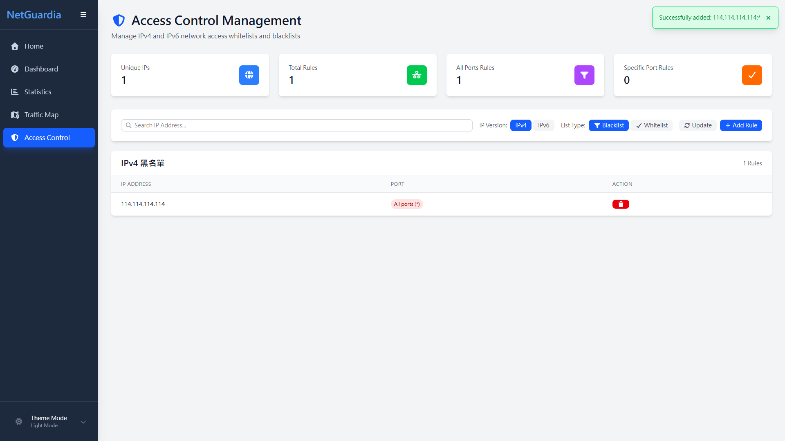

# NetGuardia

## Project Overview

**NetGuardia** is a high-performance network security solution that combines eBPF XDP technology with deep learning models to provide advanced network protection. The system operates as a standalone network appliance that can run on any Ubuntu-based system with compatible network hardware.

## Core Technologies

- **eBPF XDP Technology** - Provides high-performance packet processing directly at the data link layer
- **Deep Learning Models** - Identifies and predicts potential network attacks with intelligent threat detection
- **Hardware Integration** - Designed to work with Intel i350 T2 and similar enterprise-grade network interface cards

## Functional Modules

### Resource Overview

- Real-time control system occupancy rate

### Dashboard Overview

- Real-time network traffic monitoring and visualization
- Recent traffic statistics and trend analysis

### Detailed Traffic Statistics

- Detailed traffic usage information per IP address

### Network Access Control

- IPv4/IPv6 whitelist and blacklist management
- Precise port-level access control

[//]: # (### AI Attack Detection)

[//]: # (![AI 攻擊偵測介面]&#40;.github/images/aiDetection.png&#41;)

[//]: # (- AI-based attack detection engine)

## System Features

- **High Performance** -  Low-latency packet processing with minimal network performance impact
- **User-Friendly** - Cross-platform web management interface with intuitive operation
- **Reliability** - Hardware-accelerated processing ensures stable operation
- **Scalability** - Modular design supports functional expansion

## System Requirements

- Ubuntu-based operating system (Ubuntu 24.04 LTS or newer recommended)
- Dual-port network interface card (Intel i350 T2 or compatible XDP-capable NIC)
- Root/sudo access for eBPF program loading

## Hardware Compatibility
NetGuardia is designed to work on any Ubuntu-based system meeting the following requirements:

- Network Interface: Any dual-port NIC supporting XDP native or offload mode (Intel i350 T2 recommended)
- CPU: Multi-core processor recommended for optimal performance
- Memory: 8GB RAM minimum, 16GB or more for high-traffic environments

The system is not limited to embedded platforms and can be deployed on standard server hardware, virtual machines, or dedicated appliances running Ubuntu.

