# NetGuardia

Inline network security platform built on eBPF/XDP. Combines ONNX-based ML, temporal beaconing, correlation heuristics, and Suricata `eve.json` alerts in one fusion path, drives SOAR playbooks, and writes decisions into a WORM audit chain.

## Stack

- **Data plane** — eBPF / XDP / AF_XDP (aya, xsk-rs)
- **Detection** — Rust + tract-onnx for ML, custom temporal / graph engines, Suricata `eve.json` ingest
- **Control plane** — actix-web REST + WebSocket, SQLite + SQLCipher, argon2 / JWT / CSRF, per-playbook SOAR
- **Frontend** — Vue 3 + Pinia + Vue-i18n (en / zh-TW / zh-CN / ja)
- **Architecture** — hexagonal-ish Rust workspace: `domain/` · `interface/` · `core/` · `adapter/` · `infrastructure/`

## Capabilities

NetGuardia sits inline between network segments, observes traffic, detects threats, and applies policy or automated response from one control plane.

### Traffic Visibility

- Live security overview with threat counts, traffic rate, system health, recent alerts, and SOAR activity.
- Per-IP traffic statistics for bytes, packets, last-seen time, direction, address family, and source/destination views.
- Network and attack maps for geographic flow visualization and attack-source distribution.
- Flow trace recording for offline training, incident review, and audit workflows.

### Threat Detection

- ML-assisted traffic detection using ONNX runtime models and a pipeline adapter.
- Multi-source fusion across ML signals, temporal beaconing, correlation heuristics, and Suricata `eve.json` alerts.
- Alert details with confidence, anomaly score, classifier score, connection metadata, protocol, source, and destination.
- Drift detection and audit events for model behavior changes.
- BYO model upload, validation, promotion, and offline mode for custom pipeline bundles.

### Inline Enforcement

- IPv4 and IPv6 access-control lists with blacklist and whitelist support.
- GeoIP country blocking for region-based policy.
- DNS blacklist filtering for suspicious domains.
- HTTP and SSH protocol/service access rules.
- Packet, SYN, UDP, and DNS rate limits for DDoS-oriented controls.
- Real-time drop monitor for intercepted packet events.

### Automated Response

- SOAR playbooks with triggers, conditions, cooldowns, and response actions.
- Dry-run mode for testing playbook behavior before enabling automation.
- Execution history for automated actions such as IP blocks.
- SOAR whitelist and active auto-block tracking.

### Operations And Administration

- WORM-style audit log with chain verification for administrative and detection events.
- Live log stream with level filtering, search, follow/pause, and archived log download.
- Security report with threat breakdown, SOAR summary, system health, PDF download, and email delivery.
- User, group, RBAC permission, and API key management.
- System health dashboard for CPU, memory, temperature, OS, NIC counters, engine mode, and boot time.
- Runtime settings for general mode, network interfaces, notifications, detection, threat analysis, SOAR, and system integrations.

## Screens

<table>
<tr>
<td>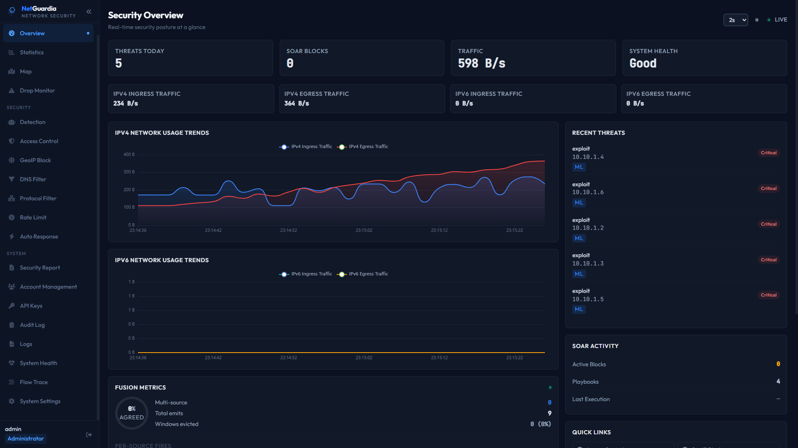 Security overview with live posture, trends, threats, and SOAR activity</td>
<td> Traffic statistics (per-IP bytes/packets)</td>
<td> Live geographic flow map</td>
</tr>
<tr>
<td>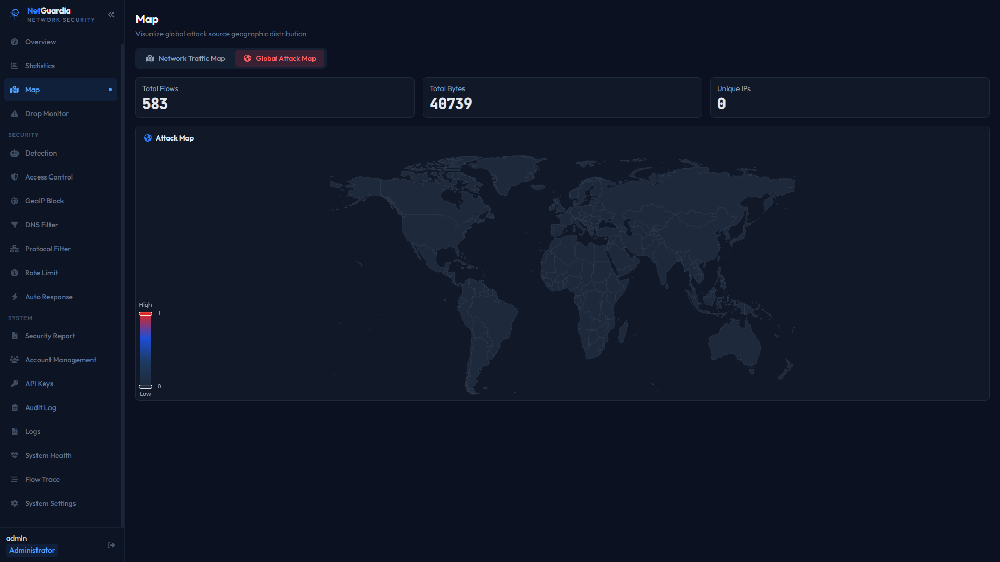 Global attack-source distribution</td>
<td> Real-time drop monitor</td>
<td> Threat detection alert queue</td>
</tr>
<tr>
<td>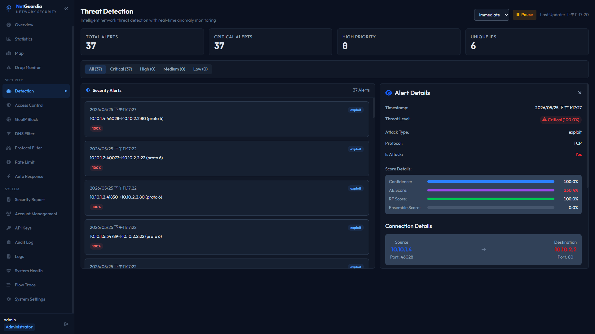 Alert details with model scores and connection metadata</td>
<td> IPv4/IPv6 allow + block lists</td>
<td> GeoIP country block</td>
</tr>
<tr>
<td> DNS blacklist</td>
<td> Per-class DDoS rate limits</td>
<td> HTTP / SSH service rules</td>
</tr>
<tr>
<td> SOAR playbook management and dry-run</td>
<td>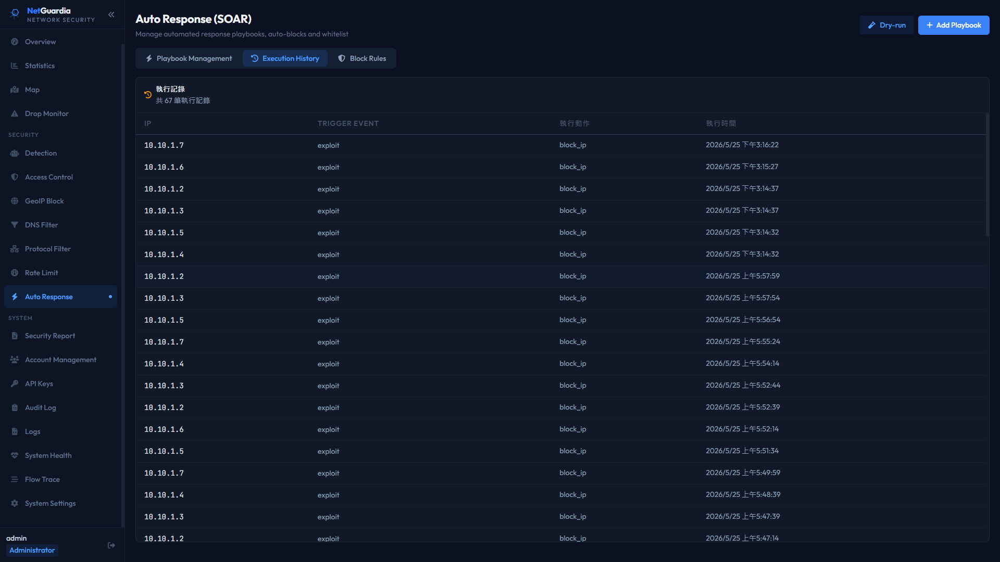 SOAR execution history</td>
<td>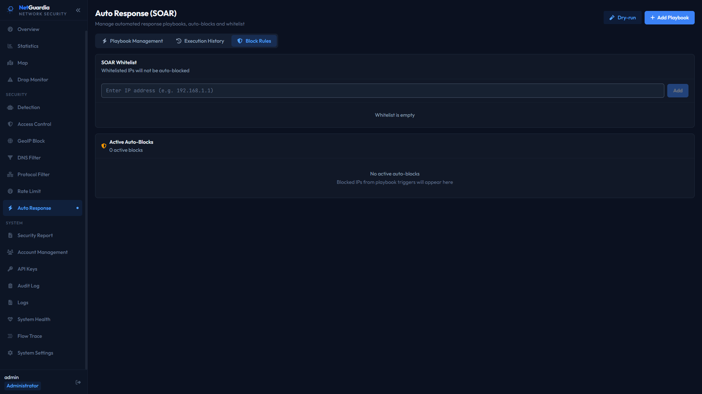 SOAR whitelist and active auto-blocks</td>
</tr>
<tr>
<td> Security report (PDF / email)</td>
<td> Users + groups + RBAC</td>
<td>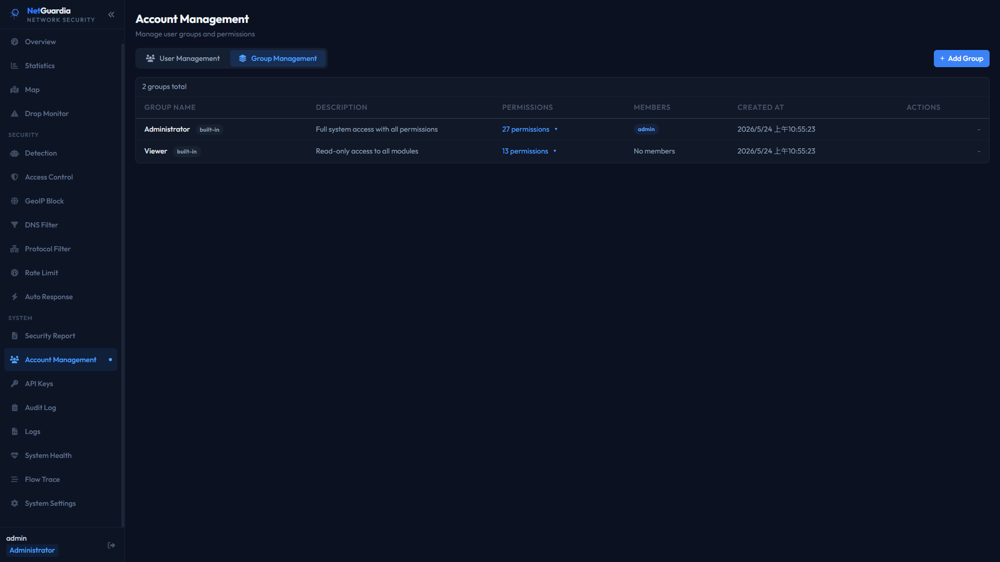 Built-in and custom permission groups</td>
</tr>
<tr>
<td> API keys</td>
<td> WORM-chained audit log</td>
<td> Live + archived logs</td>
</tr>
<tr>
<td> CPU / memory / NIC counters</td>
<td> Rotated flow recording</td>
<td> Mode / theme / HTTP / engine</td>
</tr>
<tr>
<td>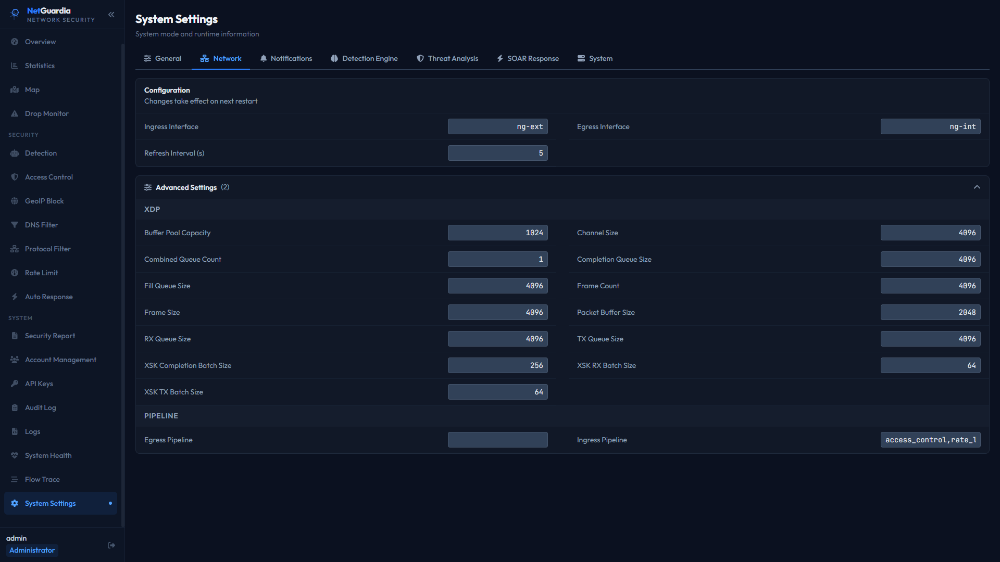 Network interfaces, XDP, and pipeline settings</td>
<td>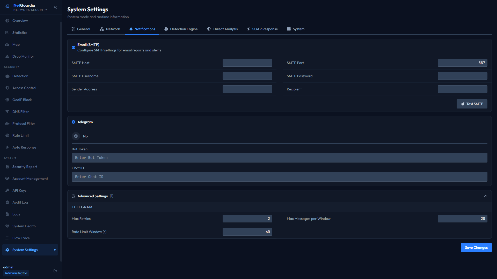 SMTP and Telegram notification settings</td>
<td>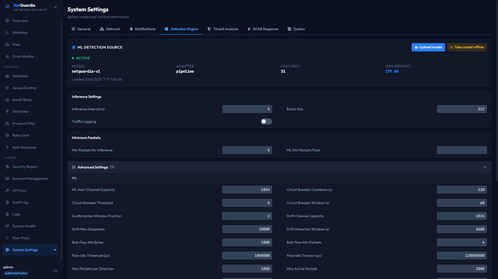 ML model status, inference, and BYO upload controls</td>
</tr>
<tr>
<td>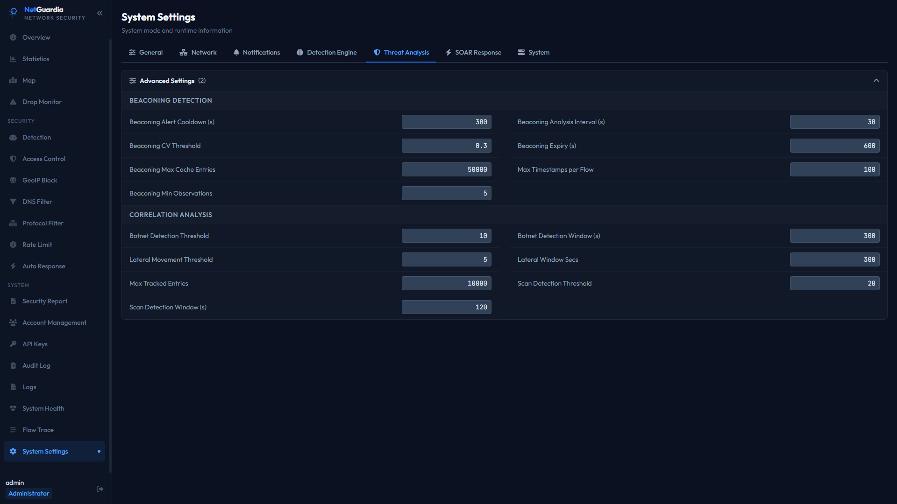 Beaconing and correlation thresholds</td>
<td>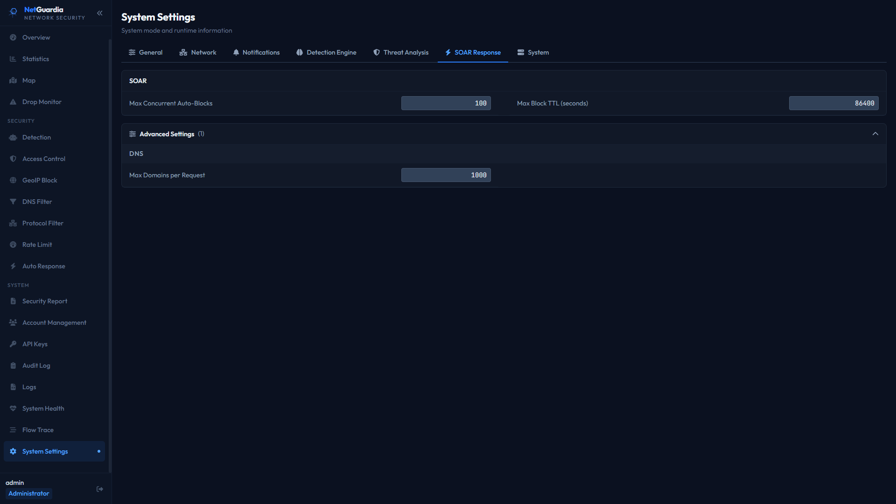 SOAR limits, TTL, and DNS action settings</td>
<td>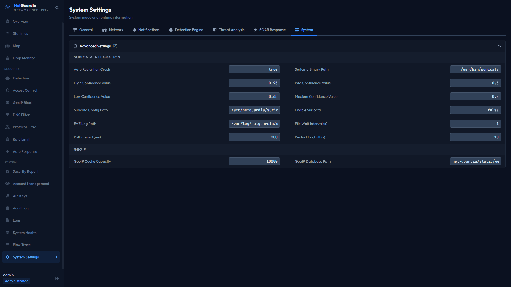 Suricata and GeoIP integration settings</td>
</tr>
</table>
